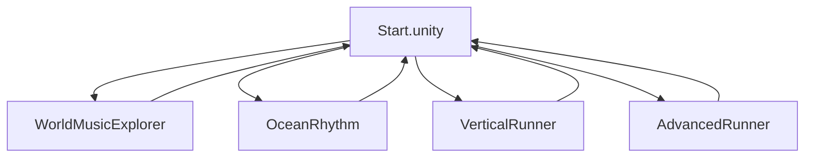

# Game Design Document

**Project:** Rhythm Runner (`Final game`)  
**Document version:** 1.0  
**Last updated:** 2026-06-16  
**Status:** Submission vertical slice complete (four modes playable from Start)

---

## Table of contents

1. [Game title](#1-game-title)
2. [One-sentence game idea](#2-one-sentence-game-idea)
3. [Intended player experience](#3-intended-player-experience)
4. [Core mechanic](#4-core-mechanic)
5. [What the player does moment to moment](#5-what-the-player-does-moment-to-moment)
6. [Target player](#6-target-player)
7. [Reference games or inspirations](#7-reference-games-or-inspirations)
8. [What is original or creative](#8-what-is-original-or-creative-about-your-idea)
9. [Vertical slice plan](#9-vertical-slice-plan)
10. [Feature priority (MoSCoW)](#10-feature-priority-moscow)
11. [Unity development plan](#11-unity-development-plan)
12. [Main systems and scripts](#12-main-systems-and-scripts-you-expect-to-build)
13. [Asset and resource plan](#13-asset-and-resource-plan)
14. [Legal, ethical, social, accessibility, and security](#14-legal-ethical-social-accessibility-and-security-considerations)
15. [Development schedule and milestones](#15-development-schedule-or-milestone-plan)

---

## 1. Game title

**Rhythm Runner** (internal Unity project folder: `Final game`)

Mode names shown to players (examples):

| Mode | Menu label (approx.) | Age band |
|------|----------------------|----------|
| World Music Explorer | World music / exploration | 0–5 |
| Little Rhythm Ocean | Rhythm Ocean | 5–10 |
| Vertical Runner | Jumping follow the rhythm | 5–10 |
| Advanced Runner | Advanced Runner / Challenge | 10–15+ |

---

## 2. One-sentence game idea

A multi-mode rhythm learning game that pairs music with clear visuals and age-appropriate interaction—from free exploration of world music for toddlers to beat-timed climbing, catching, and lane-running for older children.

---

## 3. Intended player experience

### By age band (design intent)

| Age | Intended experience |
|-----|---------------------|
| **0–5** | Low pressure: hear traditional music, see representative images; any key changes track; build early sound–image associations |
| **5–10** | Learn four common meter/rhythm types through play; collect fish; unlock Bucket decorations as motivation |
| **10–15** | Rhythm runner with stronger visual beat guidance; tutorial images and HUD prompts for players with little musical background |
| **15+ / Challenge** | Multi-lane, multi-action rhythm challenge with optional beat-assist toggles from Start settings |

### Cross-mode pillars

- **See the beat** — Beat lanes, four-column prompts, pulse feedback  
- **Short, child-friendly text** — No abstract “music theory lecture” in UI  
- **Hierarchy-editable art** — Designers adjust sprites and layout in scenes; runtime does not rebuild main UI layout  

---

## 4. Core mechanic

**Rhythm-aligned input:** player actions are judged against a shared beat clock (music time or configured BPM).

| Mode | Core loop |
|------|-----------|
| World Music Explorer | Press any ordinary key → switch track; audio + visual root swap |
| Ocean Rhythm | Select fish → listen preview → tap/Space on beat → capture progress → Bucket rewards |
| Vertical Runner | Space on jump beats; Down/S on action beats; Space + direction on parrot branches |
| Advanced Runner | Match falling target action and lane when target reaches judgement line |

**Shared:** `RhythmManager` (or mode-specific audio clock) drives timing; UI visual beat may be slightly delayed for feel (`visualBeatDelaySeconds`).

---

## 5. What the player does moment to moment

### World Music Explorer

1. Scene loads with first region item  
2. Music plays; layered images animate  
3. Press any keyboard key (filtered) → next item  
4. Optional: Back → Start menu  

### Ocean Rhythm (Free Pond)

1. Intro card → idle BGM  
2. Tap pond fish → optional beat-info card → listen preview  
3. Press Space/TAP on beat → Perfect/Good advances capture  
4. Fish rescued → shells, Bucket unlocks, optional Singing Shell  
5. Mystery fish spawns on timer  

### Vertical Runner

1. Briefing / rules → 8-beat listen countdown  
2. Each beat cycle: jump (Space) or action beat (banana / parrot)  
3. HUD: misses, score, bananas, combo, beat lane, tutorial images  
4. Back / Retry during play; tutorial completes → game rules → formal climb  

### Advanced Runner

1. Tutorial overlay → Start → chart spawns from table  
2. Targets fall; player Jump / Slide / Left / Right on lane  
3. One miss ends run (game mode); score on result  
4. Retry or Back  

---

## 6. Target player

| Segment | Description |
|---------|-------------|
| **Primary** | Children 0–15+, grouped by mode difficulty |
| **Secondary** | Parents/educators seeking low-friction rhythm exposure |
| **Tertiary** | Players with limited prior musical training (explicit visual assist) |

**Not primary:** Competitive esports rhythm players (Advanced is challenging but not chart-editor focused).

---

## 7. Reference games or inspirations

| Reference | What we borrow |
|-----------|----------------|
| Rhythm runners (e.g. endless runners with beat gates) | Forward pressure + timed jumps |
| Children's music apps | Simple input, strong visuals, short instructions |
| Pond/collection games | Catch loop, cosmetic unlocks (Bucket) |
| Music discovery / “press to skip” UIs | World Music Explorer low-friction browsing |

*Note: References are conceptual; this project uses custom scenes, templates, and code-generated routes.*

---

## 8. What is original or creative about your idea

1. **Single product, four age-calibrated modes** in one menu—not one difficulty slider.  
2. **Template + runtime generation** — Platforms/charts from data; art in Hierarchy templates; avoids hand-placed beat prefabs.  
3. **Three route data shapes** — Vertical link graph, Advanced event table, Ocean track repository.  
4. **Dual beat clock** — Judgment vs delayed HUD for low-musicality players.  
5. **Manager-centric architecture** — Scene-owned UI; runtime binds paths; Baker repairs contracts in Editor.  
6. **World traditional music + regional imagery** for earliest age band without performance pressure.  

---

## 9. Vertical slice plan

**Definition:** One playable path per target age band, shippable in Unity Player from `Start` scene.

| Slice | Scene | Minimum playable proof |
|-------|-------|------------------------|
| **VS-0** | WorldMusicExplorer | 3+ items, audio + visuals, key switch, Back |
| **VS-1** | OceanRhythm | Free Pond, 4 meter fish, capture loop, Bucket UI |
| **VS-2** | VerticalRunner | Tutorial steps + game mode, countdown, miss HUD, Back/Retry |
| **VS-3** | AdvancedRunner | Game chart, lanes, judgement, score result |

**Current state (approx.):** All four scenes exist in Build Settings; core loops implemented; polish and balancing ongoing.

**Slice demo script (5 min):** Start → each mode 1–2 min → highlight beat UI + one success + one teaching moment.

---

## 10. Feature priority (MoSCoW)

### Must-have

- Start menu with four mode entries  
- World Music Explorer: key switch + audio + visuals  
- Ocean: Free Pond, beat tap, fish capture, basic Bucket  
- Vertical: tutorial + game, jump/banana/parrot rules, miss counter  
- Advanced: game chart, lane actions, score on fail/complete  
- Shared `RhythmManager` / per-mode clocks  
- Hierarchy-owned UI (no runtime layout overwrite)  
- Asset license documentation (`ASSET_LICENSES.md`)  

### Should-have

- Ocean Singing Shell mini-game  
- Mystery fish spawn  
- Vertical / Advanced four-column rhythm prompt + Start beat-assist toggle  
- Vertical tutorial images in formal game  
- Leaderboard (Easy) for Vertical game mode  
- EditMode scene contract tests  
- Editor Hierarchy Bakers for contract repair  

### Could-have

- More tracks per meter in Ocean repository  
- Additional World Music regions/items  
- Advanced tutorial path without skip  
- Localization beyond English UI  
- Accessibility: remappable keys, color-blind beat cues  

### Cut-first (if scope slips)

- Extra Advanced lanes (stay 3-lane)  
- In-game chart editor  
- Online multiplayer / accounts  
- Heavy narrative cutscenes  
- Procedural music generation  
- Re-enabling legacy bunny horizontal runner (`BunnyLegacyArchive`)  

---

## 11. Unity development plan

### Engine and workflow

| Item | Choice |
|------|--------|
| Engine | Unity (2D, UI + world sprites) |
| Structure | Multi-scene: `Start` + one scene per mode |
| UI | Scene Hierarchy Canvas; runtime binds paths only |
| Gameplay objects | Templates (inactive) + runtime spawn (Vertical/Advanced) |
| Editor tools | `Assets/Editor/HierarchyBakers/` → `Tools → Rhythm Runner` |
| Memory | `PROJECT_MEMORY.md` required read/write on changes |
| Verification | EditMode tests; Unity Play; avoid broken `dotnet build` on this machine |

### Development phases (technical)

1. **Foundation** — Shared rhythm, scene transitions, Start menu  
2. **Per-mode scenes** — Ocean, Vertical, Advanced, World Explorer  
3. **Contract hardening** — Bakers, EditMode tests, script folder layout  
4. **Polish** — Visual beat assist, Inspector tuning, UI feedback  
5. **Submission build** — Build Settings, licenses, documentation  

See [PROJECT_FILE_MAP.md](./PROJECT_FILE_MAP.md) for folder layout.

---

## 12. Main systems and scripts you expect to build

### Shared (`Assets/Scripts/Shared/`)

| System | Scripts (examples) |
|--------|-------------------|
| Beat clock / windows | `RhythmManager` |
| Scene policy | `RuntimeScenePolicy` |
| Navigation | `SceneTransitionManager`, `ChangeScene` |
| Leaderboard | `LeaderboardManager`, bootstrap |

### Per mode

| Mode | Manager | Key collaborators |
|------|---------|-------------------|
| Start | `StartMenuController` | `StartMenuMusicVisualizer`, cover stage |
| World Explorer | `WorldMusicExplorerController` | Scene items, AudioSource per item |
| Ocean | `OceanRhythmManager` | `OceanRhythmUIController`, `OceanPondAnimal`, bucket album |
| Vertical | `VerticalRunnerManager` | `VerticalRunnerPlayer`, `VerticalBeatSpawner`, `VerticalRunnerUI` |
| Advanced | `AdvancedRunnerManager` | `AdvancedRunnerPlayer`, `AdvancedRunnerUI` (in `AdvancedRunner.cs`) |

### Editor

| Tool | Scripts |
|------|---------|
| Hierarchy Bakers | `AllSceneHierarchyBaker`, `VerticalSceneHierarchyBaker`, `SceneHierarchyBaker` |

### Data patterns (implementation)

| Mode | Pattern | Code anchor |
|------|---------|-------------|
| Vertical | Link | `VerticalRunnerPlatform.defaultNext`, `LinkDefault` |
| Advanced | Table | `List<AdvancedBeatTarget>`, `BuildGameChart` |
| Ocean | Repository | `OceanTrackDefinition[]`, `PickRandomTrack` |

Detailed script index: `SCRIPT_REFERENCE.md` / `SCRIPT_REFERENCE_ZH.md`.

---

## 13. Asset and resource plan

### Art

| Source | Use | License (see `ASSET_LICENSES.md`) |
|--------|-----|-------------------------------------|
| Kenney packs | UI, fish, mushroom, backgrounds, icons | CC0 |
| `Assets/vertical/`, `Assets/catsSee/` | Vertical / Advanced visuals | Mixed; verify per file |
| Scene Hierarchy | Primary authored sprites for modes | Project / owner |
| Owner photos / drawings | Some backgrounds | Owner-stated ownership |

### Audio

| Pool | Use |
|------|-----|
| `Assets/globalmusic/`, `Assets/music/`, mode-specific folders | Mode BGM and teaching tracks |
| Per-scene AudioSource | World Explorer items, RhythmManager clip |
| Owner statement | Music treated as CC0 for this project |

### Prefabs vs templates

- **No hand-placed beat prefabs** for Vertical/Advanced routes  
- **Inactive templates** in scene (`VerticalRunnerTemplates`, `AdvancedTargetTemplates`) cloned at runtime  

### Tools

- Unity Editor + optional batchmode Baker  
- Cursor / IDE for scripts  
- Git for version control  

---

## 14. Legal, ethical, social, accessibility, and security considerations

### Legal

- Maintain `Assets/AssetLicenses/ASSET_LICENSES.md` for third-party assets  
- Kenney CC0: credit appreciated, not required  
- Confirm license for any font, custom image, or music not yet documented  
- Do not commit credentials or API keys (none required for current offline game)  

### Ethical / social

- Age-banded design: no punitive failure for 0–5 mode  
- Traditional music paired with respectful regional imagery (review content with stakeholders)  
- Miss-based feedback instead of violent “death” in Vertical  
- Child-oriented short text; avoid gambling-like monetization (none in current scope)  

### Accessibility (current + planned)

| Area | Current | Target |
|------|---------|--------|
| Input | Keyboard only in several modes | Should-have: clearer key hints |
| Vision | Beat lane, large HUD, tutorial images | Could-have: assist toggle (partial: Start beat-assist) |
| Hearing | Gameplay tied to rhythm | Optional visual-only beat path already emphasized |
| Motor | Single-key / few keys | Low simultaneous key demand in Vertical/Ocean |

### Security

- Offline Unity client; no user accounts in core loop  
- Leaderboard local / project-defined (verify storage location if expanded)  
- No network stack in described vertical slice  

---

## 15. Development schedule or milestone plan

*Example milestone table—adjust dates to your course or release target.*

| Milestone | Deliverable | Status |
|-----------|-------------|--------|
| **M0 — Repo & archive** | Project structure, bunny legacy isolated, `PROJECT_MEMORY.md` | Done |
| **M1 — Scene map** | Start + 4 modes in Build Settings | Done |
| **M2 — Ocean slice** | Free Pond, Bucket, track repository | Done |
| **M3 — Vertical slice** | Tutorial + game unified scene, spawner, miss HUD | Done |
| **M4 — Advanced slice** | Chart table, lanes, result flow | Done |
| **M5 — Shared rhythm & UI rules** | RhythmManager, hierarchy UI policy, Bakers | Done |
| **M6 — Polish** | Beat assist, Inspector tuning, tutorial images in game, Back/Retry | Complete |
| **M7 — Quality** | EditMode tests, license doc, design doc (`Docs/`) | Complete |
| **M8 — Submission** | Playable build, GDD, demo script, known issues list | Complete |

### Weekly focus (template)

| Week | Focus |
|------|--------|
| 1 | GDD + scene flow diagram |
| 2 | One mode polish + playtest notes |
| 3 | Cross-mode Start menu + settings |
| 4 | Tests, licenses, build + demo rehearsal |

---

## Document maintenance

- Update this file when scope, modes, or milestones change.  
- Technical detail: `PROJECT_MEMORY.md` (change log).  
- File paths: `Docs/PROJECT_FILE_MAP.md`.  

---

## Appendix A — Scene flow (diagram)

## Appendix B — Related documents

| Document | Path |
|----------|------|
| Project memory | `PROJECT_MEMORY.md` |
| Script reference (EN) | `SCRIPT_REFERENCE.md` |
| Script reference (ZH) | `SCRIPT_REFERENCE_ZH.md` |
| Asset licenses | `Assets/AssetLicenses/ASSET_LICENSES.md` |
| File map | `Docs/PROJECT_FILE_MAP.md` |
